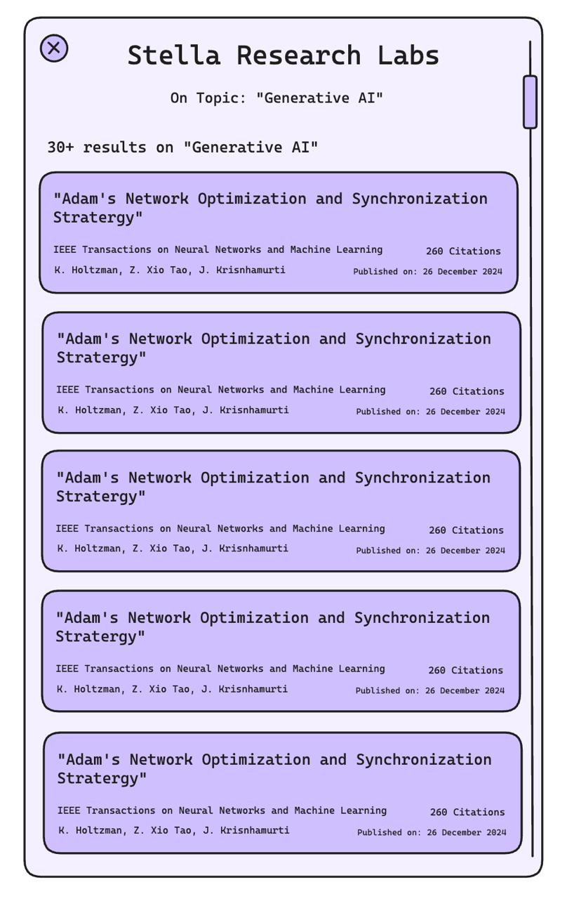

# ScholarLens 🔍

ScholarLens is a Chrome extension that uses built-in AI to enhance academic research paper reading and analysis. It provides real-time summaries, methodology analysis, and citation tracking directly in your browser.



## Features ✨

- **Smart Paper Detection**: Automatically detects research papers on Google Scholar
- **AI-Powered Analysis**:
  - Quick paper summaries
  - Methodology breakdown
  - Research gap identification
- **Citation Network**: Track and visualize paper relationships
- **Privacy-First**: Uses Chrome's built-in AI for local processing
- **Real-Time Processing**: Instant analysis as you browse
- **Multi-Language Support**: Works with papers in different languages

## Installation 🚀

### For Users

1. Clone this repository:

```bash
git clone https://github.com/Legend101Zz/scholar-lens-chrome-extension
```

2. Open Chrome and navigate to:

```
chrome://extensions/
```

3. Enable "Developer mode" in the top right corner

4. Click "Load unpacked" and select the `scholar-lens` directory

### For Developers

1. Clone and install dependencies:

```bash
git clone https://github.com/Legend101Zz/scholar-lens-chrome-extension
cd scholar-lens
```

2. Install required permissions for Chrome AI APIs:

- Sign up for Chrome's AI developer preview program
- Add your extension ID to the allowed origins
- Update manifest.json with your tokens

## Usage 📖

1. Visit Google Scholar or open a research paper PDF
2. Click the ScholarLens icon in your Chrome toolbar
3. The side panel will open with:
   - Paper summary
   - Methodology analysis
   - Citation network
4. Use the tabs to switch between different views
5. Highlight text to get instant analysis

## Technical Details 🛠️

### Architecture

```
scholar-lens/
├── manifest.json          # Extension configuration
├── background.js         # Background service worker
├── content/             # Content scripts
│   ├── content.js      # Page interaction logic
│   └── content.css     # Styles for injected elements
├── sidepanel/          # Side panel UI
│   ├── index.html     # Panel structure
│   ├── index.js       # Panel logic
│   └── style.css      # Panel styles
└── icons/             # Extension icons
```

### Chrome APIs Used

- `chrome.aiOriginTrial.languageModel`
- `chrome.sidePanel`
- `chrome.storage`
- `chrome.scripting`

### AI Capabilities

- Summarization API
- Translation API
- Write API
- Rewrite API

## Contributing 🤝

1. Fork the repository
2. Create your feature branch:

```bash
git checkout -b feature/AmazingFeature
```

3. Commit your changes:

```bash
git commit -m 'Add some AmazingFeature'
```

4. Push to the branch:

```bash
git push origin feature/AmazingFeature
```

5. Open a Pull Request

## Development Setup 💻

### Prerequisites

- Chrome browser (version 131 or later)
- Node.js and npm (for development tools)
- Access to Chrome's AI developer preview program

### Local Development

1. Enable Chrome flags:

```
chrome://flags/#optimization-guide-on-device-model
```

Set to "Enabled BypassPerfRequirement"

2. Test changes:

- Make changes to code
- Go to `chrome://extensions/`
- Click the refresh icon on your extension
- Test in a new tab

### Testing

1. Manual testing checklist:

- [ ] Extension loads without errors
- [ ] Paper detection works on Google Scholar
- [ ] AI analysis generates meaningful results
- [ ] UI is responsive and functional
- [ ] No console errors

2. Known limitations:

- Currently only supports English papers
- PDF processing may vary by format
- AI model download required on first use

## Troubleshooting 🔧

Common issues and solutions:

1. **AI Not Available**

   - Ensure Chrome is updated to version 131+
   - Check AI developer preview program access
   - Verify internet connection for initial model download

2. **Extension Not Loading**

   - Verify Developer mode is enabled
   - Check console for error messages
   - Reload the extension

3. **Analysis Not Working**
   - Confirm paper format is supported
   - Check if AI model is downloaded
   - Verify text extraction is working

## License 📄

This project is licensed under the MIT License - see the [LICENSE](LICENSE) file for details

## Acknowledgments 🙏

- Built with Chrome's AI APIs
- Inspired by academic research needs
- Thanks to the Chrome Extensions team
- Special thanks to all contributors

## Contact 📧

- Project Link: https://github.com/Legend101Zz/scholar-lens-chrome-extension
- Report bugs: Issues page
- Feature requests: Discussions page

## Roadmap 🗺️

Future plans:

- [ ] Advanced citation network visualization
- [ ] Collaborative annotation features
- [ ] Custom AI model fine-tuning
- [ ] Extended language support
- [ ] Integration with reference managers

---

_Note: This extension is part of the Chrome AI Challenge Hackathon project._
